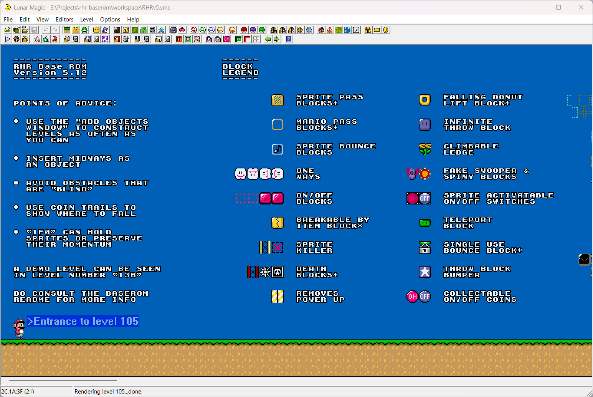

# Romhack Races Baserom



A general-purpose Super Mario World hacking baserom provided by Romhack Races.

This project has no license nor do the maintainers claim any rights to the resources included in this project, those remain the rights of their respective authors.

For how to use the baserom itself view the Readme.html for more details.

## Releases

The latest stable version is available from the [releases on GitHub](https://github.com/romhackraces/baserom/releases) for both Windows and Non-Windows (Linux/Mac).

## Setup

### Windows

1. **Provide a Clean ROM**
Put a copy of your clean, headered Super Mario World ROM in the resources folder, renamed "clean.smc"

2. **Run The Setup Script**
Run both actions that you're prompted to do by the `setup.bat` script–to download all the tools and do a first build of your project.

3. **Use Callisto**
After setup, use Callisto (found in tools/Callisto) to manage your project. Run "Edit" to launch Lunar Magic, using the "Update" action to apply changes.


### Linux/Mac

1. **Provide a Clean ROM**
Put a copy of your clean, headered Super Mario World ROM in the resources folder, renamed "clean.smc"

2. **Install WINE**
Version 11 is required for the ideal experience, but a least 10 is idea. You can check the version by running `wine --version`.

3. **Install Program Dependencies**
Set up dotnet8 (or higher) in your wine prefix with winetricks:

```console
winetricks dotnetdesktop8
```

4. **Install Setup Dependencies**
This will differ between operating systems, but you should use your OS's package manager to make sure the following executables available on your system (these may be available by default):
    - 7z (7zip)
    - patch
    - curl
    - sed

5. **Run The Setup Script**
Run `./setup.sh` which will download all the tools required for the baserom. It is recommended after setup to run a Build action in Callisto.

6. **Use Callisto from the Terminal**
Run `./run-callisto.sh ACTION` where `ACTION` is one of `rebuild`, `update`, `save`, `edit`, `package`, or `profiles`. See `./run-callisto.sh --help` for more info. Note: running Callisto normally is not possible because it's TUI does not work within WINE.
